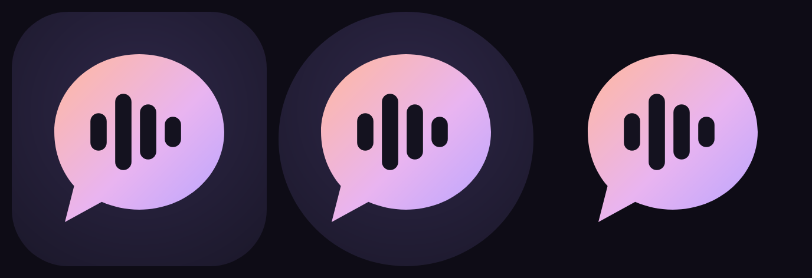
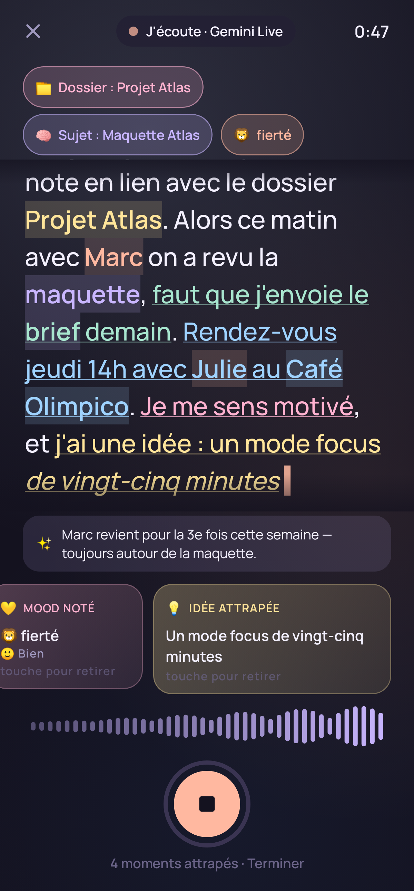
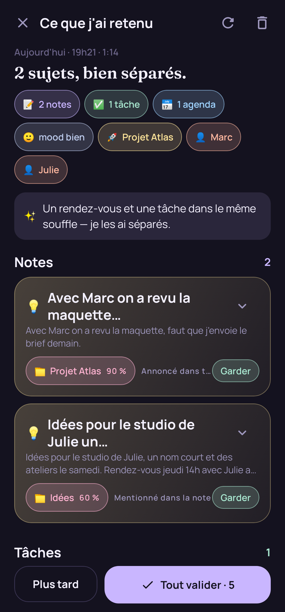
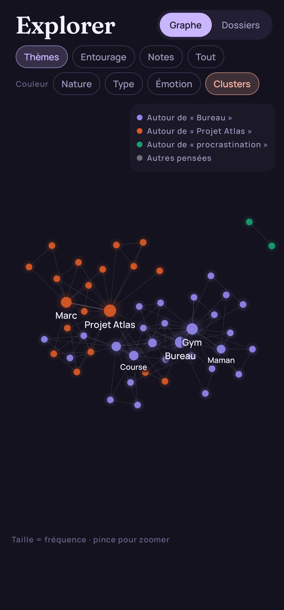
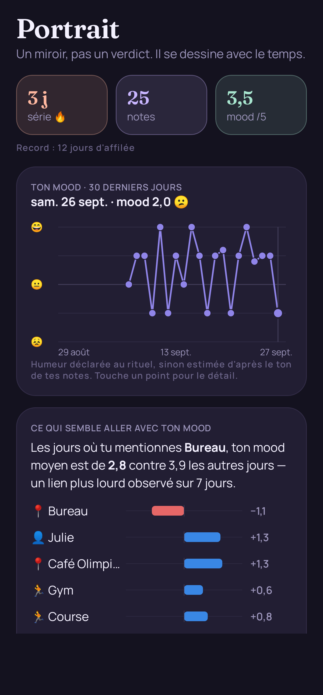

<p align="center"></p>

# Murmure — *Parle. Ça s'organise.*

**Un Obsidian entièrement vocal, pensé pour les cerveaux TDAH.** Tu ouvres, tu pèses sur un bouton, tu parles : la note s'écrit en direct, se structure, se lie à tes autres notes et se classe — **après ton accord**.

| Dictée live | Validation | Graphe | Portrait |
|---|---|---|---|
|  |  |  |  |

> Captures générées automatiquement par les tests (`docs/screens/`), avec le jeu de données démo.

---

## ⬇️ Installer l'APK (2 min)

1. Récupère **`dist/murmure-1.1.0.apk`** (ou l'artefact `murmure-apk` de la CI GitHub Actions).
2. Sur le téléphone : ouvre le fichier → Android demande d'**autoriser l'installation d'applis inconnues** pour ton navigateur / gestionnaire de fichiers → *Autoriser* → *Installer*.
   - Par câble : `adb install dist/murmure-1.1.0.apk`
3. Android 8.0+ (API 26). Testé en build pour `arm64-v8a`, `armeabi-v7a`, `x86_64`.

## 🔑 Brancher l'IA (clé Google Gemini)

1. Va sur **https://aistudio.google.com/apikey** → *Create API key* (gratuit, compte Google).
2. Dans Murmure : écran d'accueil **« On se branche »** (ou **Réglages ⚙️ → Intelligence**) → colle la clé → **Vérifier / Tester et enregistrer**.
3. L'app liste les modèles accessibles à ta clé et **choisit seule** le meilleur modèle *Live* (transcription temps réel) et le meilleur modèle d'analyse. Rien d'autre à régler.

| Moteur (Réglages) | Ce qu'il fait | Clé |
|---|---|---|
| **Automatique** *(défaut)* | Gemini Live en direct → bascule seule si besoin | Gemini |
| Gemini Live | Streaming WebSocket, texte qui apparaît pendant que tu parles | Gemini |
| Gemini par segments | Transcrit phrase par phrase (détection des silences) | Gemini |
| Google Cloud Speech-to-Text | API Speech v1 par segments | Google Cloud |
| Appareil | Reconnaissance vocale Android, sans clé | — |

**Filet de sécurité** : si Gemini Live est refusé (clé, quota, modèle), la session bascule en *segments*, puis sur l'*appareil* — **l'audio déjà capté est rejoué, rien n'est perdu** (couvert par `VoiceSessionTest`).

> La clé est chiffrée sur l'appareil (Android Keystore). Sans clé, l'app fonctionne quand même en mode appareil avec un classement proposé localement.

## 🧠 Nouveau en 1.1 — le cerveau live

- **Moments** : pendant que tu parles, chaque fragment signifiant est typé et mis de côté en direct — *note*, *tâche*, *agenda*, *mood*, *idée* — avec une carte qui glisse dans l'écran (« Tâche repérée », « Ajouté à l'agenda »), une vibration double et un blip. Passe locale instantanée (regex FR-QC) + passe IA toutes les ~7 s (sujet, charge émotionnelle, insight).
- **Une dictée = plusieurs choses** : l'écran « Ce que j'ai retenu » découpe en N notes, tâches, rendez-vous et mood. « Tout valider · n » en un tap ; chaque élément reste modifiable.
- **Écoute sans bouton** : sur l'accueil, commence à parler — la dictée démarre seule avec les 2 dernières secondes déjà captées (désactivable dans Réglages).
- **Aura plein écran** qui respire avec ta voix et prend la teinte de l'émotion perçue ; bandeau *Dossier · Sujet · Émotion* ; insight en direct.
- **Feeling** : sons courts (début, fin, moment, succès), retours haptiques, boutons qui s'enfoncent, tooltips sur les icônes, transitions d'écran.
- **Agenda** : onglet regroupant tâches et rendez-vous à venir ; insight du jour sur l'accueil.

## 🧭 Parcours

1. **Ouvrir** → un gros orbe qui respire. Aucune décision avant de parler.
2. **Parler** → le texte s'écrit en direct. Dis *« une note pour le dossier X »* : l'intention est détectée à l'oral.
3. **Surlignage live** → personnes, lieux, activités, projets et concepts reconnus sont surlignés et reliés (mécanique `[[liens]]` / rétroliens à la Obsidian).
4. **Fin** → l'IA structure la note (titre, résumé, Markdown), propose **dossier + classification** (type, émotion, énergie, entités, moment) et **tâches avec échéance**.
5. **Validation humaine** → *un tap* pour classer, *un tap* pour changer. Rien n'est appliqué sans accord. « Plus tard » garde la note dans la boîte.

**Aussi dans l'app :** Explorer (graphe à forces : thèmes, entourage, notes, clusters de pensée — ou arborescence vivante des dossiers) · comptes rendus IA par dossier · Tâches (à confirmer / en retard / aujourd'hui / semaine) · **Rituel quotidien** (mood en 1 tap, minuteur 5 min, série 🔥, rappel du soir) · **Portrait** (tendance de mood, corrélations activités ↔ mood, entourage et tonalité, moments de la journée, lecture IA descriptive) · Réglages (export JSON, suppression totale, mode démo).

## 🎨 Branding

- **Nom** : *Murmure* — la voix basse, intime, qu'on n'a pas besoin de mettre en forme. Ton : tutoiement québécois, bienveillant, jamais prescriptif.
- **Logo** : bulle de parole en dégradé pêche → lilas, onde vocale en creux.
- **Palette « Nuit douce »** (interface) :

| Encre | Surface | Lilas | Pêche | Menthe | Ciel | Beurre | Rose |
|---|---|---|---|---|---|---|---|
| `#14121F` | `#221E33` | `#C9B6FF` | `#FFB8A0` | `#A8E6CF` | `#9FD3FF` | `#FFE59A` | `#FFB3D1` |

- **Couleurs de données** (graphe, courbes) validées daltonisme/contraste sur fond sombre : violet `#9085E9`, orange `#D95926`, aqua `#199E70` + divergente bleu `#3987E5` ↔ gris ↔ rouge `#E66767` pour la charge émotionnelle.
- **Typo** : *Fraunces* (titres, serif douce et expressive) + *Manrope* (texte, très lisible). Embarquées, hors ligne.
- **Mécaniques** : orbe organique qui respire, page qui « s'écrit » avec curseur, puces colorées par nature, célébration de série en fin de rituel.

## 🏗️ Architecture

```
Micro (AudioRecord 16 kHz) ─► VoiceSession ──► GeminiLiveEngine (WebSocket BidiGenerateContent + inputAudioTranscription)
                              │  repli auto └► SegmentEngine (VAD → Gemini generateContent | Cloud STT)
                              │             └► DeviceEngine (SpeechRecognizer)
                              ▼
                      Écriture live + LocalBrain (intention « dossier X », surlignage, tâches) + mots-clés IA
                              ▼
            Repository ─► NoteAnalyzer (Gemini JSON) ─► Proposition (stockée à part) ─► Validation ─► Room/SQLCipher
                              ▼
                 Graphe (forces + clusters) · Insights (corrélations) · Comptes rendus · Rappel (WorkManager)
```

- **Stack** : Kotlin, Jetpack Compose (Material 3), Room + **SQLCipher** (AES-256), OkHttp (REST + WebSocket), kotlinx.serialization, WorkManager.
- **Hors ligne d'abord** : la dictée brute est sauvegardée **avant** toute analyse. Pas de réseau → proposition locale ; l'IA peut repasser plus tard (↻).
- **Classification jamais écrasée** : la proposition IA vit dans `proposalJson`, séparée des champs validés.
- **Vie privée** : base chiffrée, clé DB et clé API protégées par l'Android Keystore, sauvegarde cloud désactivée, export JSON et effacement total. Le portrait n'envoie à l'IA que des **agrégats**, jamais le texte des notes. Aucune fonction clinique.
- **Micro fiable** : service de premier plan « micro » pendant la dictée (écran verrouillé, changement d'app).

## 🗂️ Structure

```
app/src/main/java/app/murmure/
├── voice/        AudioCapture · VoiceSession (orchestration/replis) · GeminiLiveEngine · SegmentEngine · DeviceEngine · RecordingService
├── ai/           GeminiClient · NoteAnalyzer (prompts JSON) · LocalBrain (hors ligne) · Analysis (types, émotions)
├── data/         Room : Entities · Dao · MurmureDb (SQLCipher) · Repository · DemoData
├── insights/     Insights (série, corrélations, entourage, moments)
├── core/         Vault (Keystore) · Settings · Text/Dates
├── reminder/     Rappel quotidien (WorkManager)
└── ui/           theme · components · capture (accueil, dictée, rituel) · review · explore (graphe, dossiers) · note · tasks · portrait · settings · onboarding
app/src/test/     LogicTest · VoiceEngineTest (faux serveur Gemini Live) · VoiceSessionTest (bout en bout + repli) · ScreenshotTest
dist/             APK prêt à installer
docs/screens/     Captures générées par les tests
```

## ✅ Qualité

```bash
./gradlew testDebugUnitTest   # 26 tests : logique, protocole Live, découpage audio, session complète, 12 captures d'écran
./gradlew assembleRelease     # APK signé (clé de démo) → app/build/outputs/apk/release/
```

- Le protocole Gemini Live a été vérifié contre le **vrai endpoint Google** (poignée de main + rejet d'une fausse clé) et contre un faux serveur dans les tests.
- La CI GitHub Actions rejoue tests + build à chaque push et publie l'APK en artefact.

## ⚠️ Limites connues

- Pas de téléphone ni d'émulateur disponibles dans l'environnement de build : le parcours a été validé par tests automatisés (micro simulé, serveurs simulés) et captures JVM — **premier test sur appareil réel à faire de ton côté**.
- APK signé avec une **clé de démo** (`keystore/`) : parfait pour installer, pas pour le Play Store.
- Les corrélations du Portrait deviennent parlantes après ~2 semaines de rituel (ou avec *Réglages → Mode démo*).
